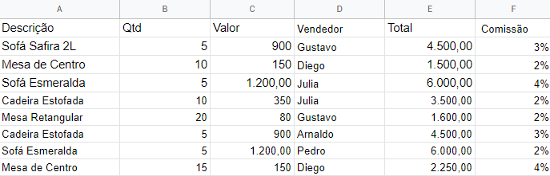
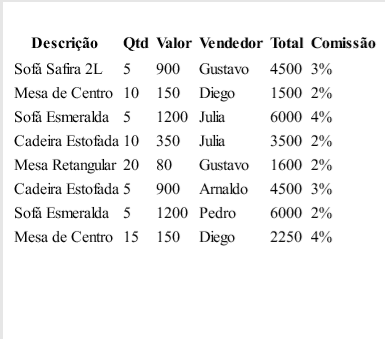
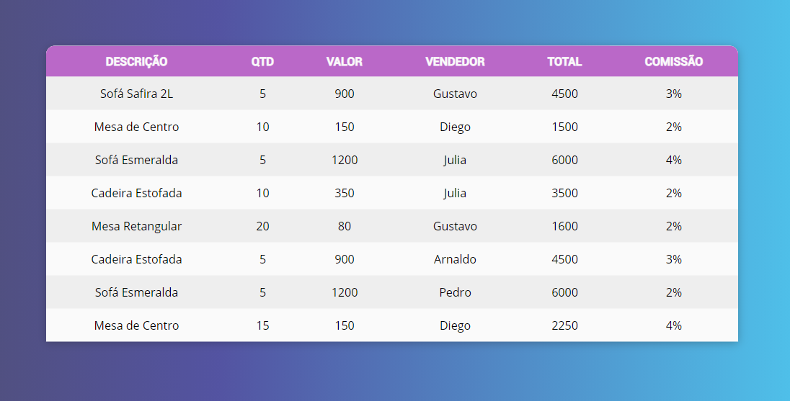

  <h1 align="center">
    Conversor de tabela / TableConverter
  </h1>

  <p align="center">Exporte seu arquivo de planilha no formato .csv,
(arquivos csv são separados por virgula).
    
   </p>
      
  <p align="center"> Seu arquivo ficara assim após a conversão. 
  
    
  </p>

<h3 align="center">
  Conversor de tabelas do excel para PDF e HTML utilizando nodejs, ejs e POO.
  Table converter with nodejs.
</h3>

### Configurações necessárias

Seguem as configurações neessárias para visualizar a aplicação na sua máquina.

- [Git](https://git-scm.com);
- [Node](https://nodejs.org/);

### Clonando o repositório

1. Pelo terminal, acesse o diretório em que deseja ter o repositório clonado e execute o comando a seguir.

```bash
# clonando o repositório
git clone https://github.com/cesaraugustomt/TableConverter.git
```

### Configurações

1. para instalar as dependências use o comando:

```
npm install
```

2. Dentro do arquivo app.js em _**var dados**_ passe o nome do seu arquivo, depois execute _**node app.js**_ no seu terminal, segue o exemplo a baixo:

```
 var dados = await leitor.Read("./vendas.csv");
```

```
node app.js
```

### Ferramentas

Recurso utilizados nesse projeto:

- [ejs](https://ejs.co/);
- [html-pdf](https://www.npmjs.com/package/html-pdf);
